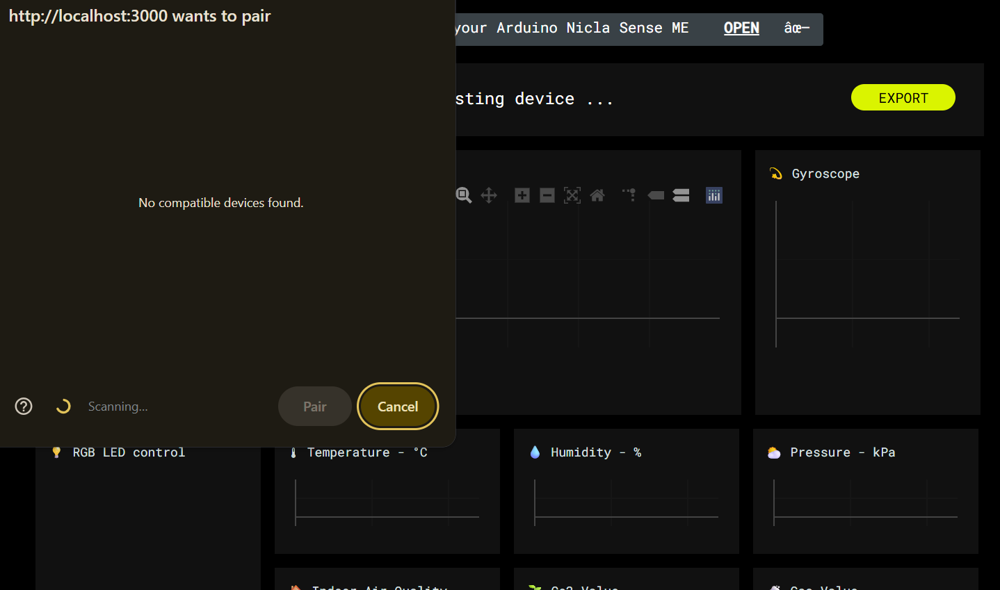
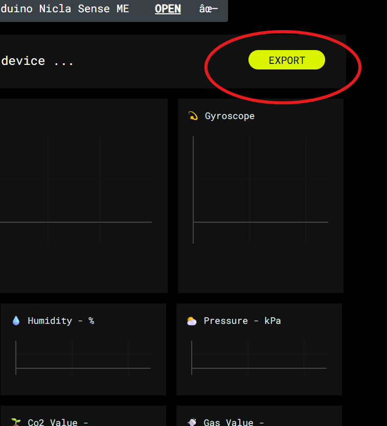

# SETUP #

## Installing Arduino Nicla Sense
Install Arduino from the Arduino website [here](https://www.arduino.cc/en/software/)

Install Github Desktop from the Github website [here](https://desktop.github.com/download/)

Clone this repository to a local folder, then pull the local changes by opening a terminal and running the following commands:
```
git clone git@github.com:NHuang58/Biomedical_Device_PCB.git
git pull
```

## Operation
Navigate to the folder with the web application
```
cd '.\Web App\NiclaSenseME-dashboard\'
```

Run the server using Python's local host:
```
python -m http.server 3000
```

*I am using port 3000, but you can use any port you would like*

After flashing the necessary code onto the device, there should be an option to connect the bluetooth device

## Collecting and Exporting Data
Connect the proper bluetooth device on the localhost, as seen in the image below:



To export the data, hit the button to the top right to generate a .CSV file. Do with the .CSV any necessary data operations


